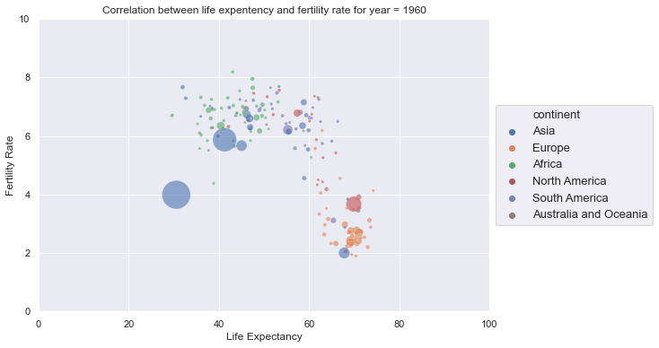

# Gif of Fertility Rate vs Life Expectancy over time based on Gapminder dataset

- Collected data from [Gapminder](https://www.gapminder.org/data/) project
- Used Pandas and Seaborn to wrangle, explore, and analyse data
- Generated Gif of Fertility Rate vs Life Expectancy over time using Seaborn and ImageIO
- Creating Interactive Data Visualization using Bokeh

*Note: To run interavtive_plot* use ```bokeh serve --show interactive_plot.py ``` in terminal
